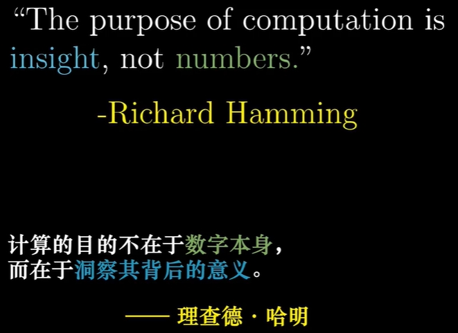
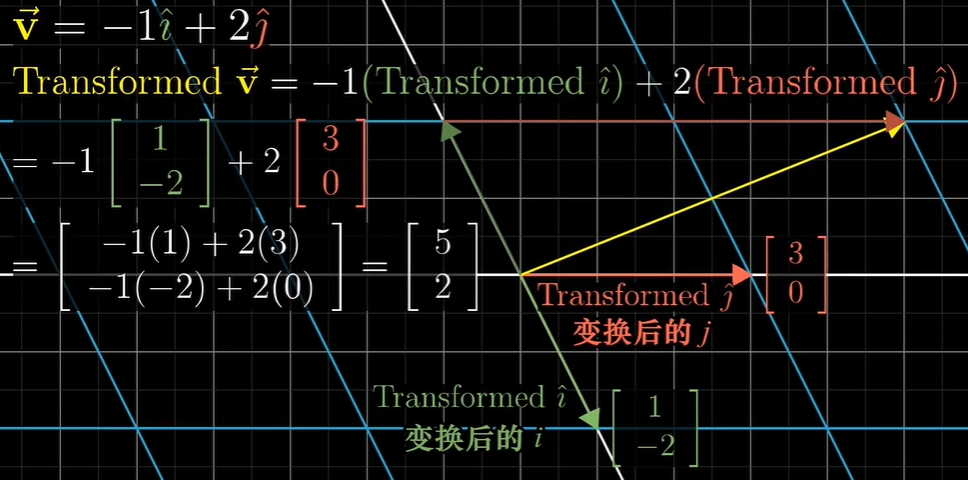
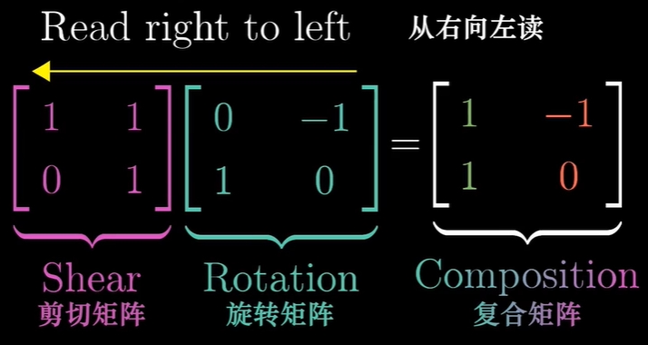
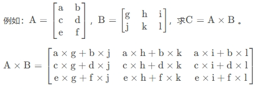

## 序言

https://www.bilibili.com/video/BV1ib411t7YR?p=1&vd_source=c680aab5d5ef234c75928d8686b004a5

为什么开设这门课程？

数值上的理解（课本上教的）能让你顺利应用这些工具。

几何直观上的理解（本课程）能让你有一个坚实的基础。

## 向量究竟是什么？

物理学：空间中的箭头（箭头长度、箭头方向）

计算机：数字列表（列表长度、列表维度）

数学家：将上述两个想法抽象，并可以计算，保证**向量相加**以及**数字与向量相乘**（向量的数乘）是有意义的。

向量相加：

向量的数乘：

## 线性组合、张成的空间、线性相关

基、基向量：单位向量

线性组合：

张成的空间：线性组合构成的空间。

线性相关：

* 表述1：至少有一个向量，可以被其他向量表示。因为它已经落在其他向量表示的张成的空间中。
* 表述2：至少有一个向量可以移除，而不减少张成的空间。

线性无关：所有向量都给张成的空间增加了维度。

## 线性变换与矩阵的关系

向量的变换就叫**线性变换**。

什么是变化？变换本质上就相当于函数。

为什么用变换不用函数？变换在暗示你用**运动**去思考。

为什么叫线性变换？因为变换后“网格线保持平行且等距分布”

向量如何变换？基向量变换即可。

把这一变换过程抽离出来，就是矩阵。矩阵的作用就是变换。

1、矩阵可以看作一个函数。

2、矩阵的列可以看作是变换后的基向量。

3、矩阵向量的乘法可以看作一个线性组合。

## 矩阵乘法与线性变换的关系

我们想做两个线性变换：旋转、剪切。既可以用一个矩阵表示、也可以用两个矩阵表示。

所以矩阵乘法：

逐步分解矩阵乘法：

公式化表示：

注意：

1、不满足交换律（因为先旋转再缩放，和先缩放再旋转的变换过程是不一样的）

2、满足结合律和分配律

## 矩阵的行列式

矩阵就是线性变换。

线性变换的行列式就是测量变换对空间有多少拉伸或挤压。即，测量一个给定区域面积缩放的比例。

如何解释行列式有负数？变换会改变空间的定向（方向）。

行列式计算公式：

定理：矩阵乘积的行列式等于行列式的乘积

## 逆矩阵、列空间、秩

线性方程组：

如果求解x：用A的逆矩阵

什么时候存在解？

当行列式不等于0时，矩阵线性无关，存在唯一解。

当行列式等于0时，矩阵线性相关，A不存在逆矩阵，但是解仍然存在（bu）。

