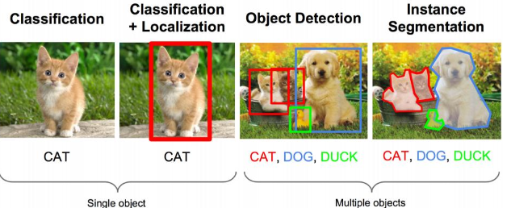
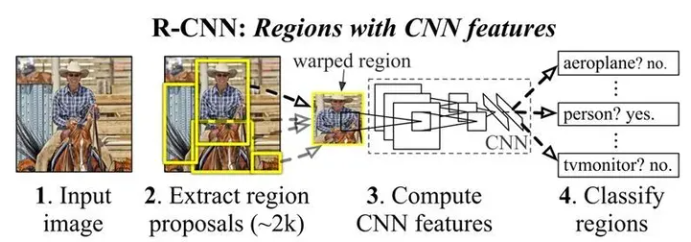
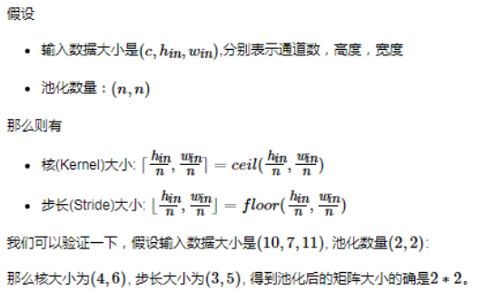
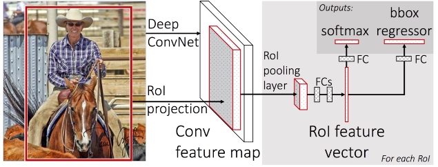
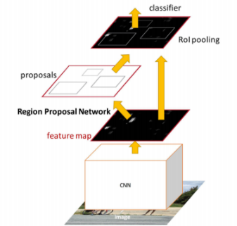
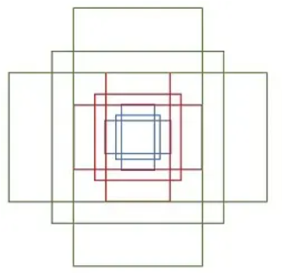
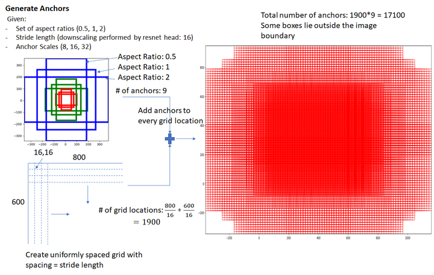
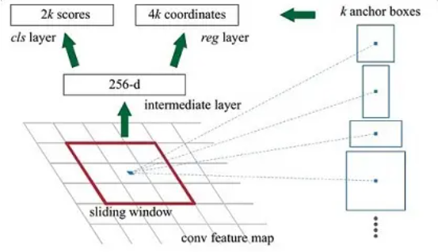
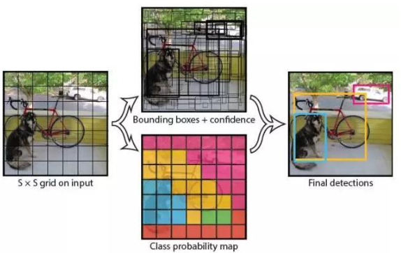

> https://blog.csdn.net/v_july_v/article/details/80170182

# 传统目标检测算法

这个任务本质上就是这两个问题：一：图像识别，二：定位。

一：图像识别：输入是图片，输出是类别。

二：定位：输入是图片，输出是方框的位置（x,y,w,h）

为什么要图像识别？：因为regression的训练参数收敛的时间要长得多，所以通常采取了用classification的网络来计算出网络共同部分的连接权值。（这一步可做可不做）

思路一：回归问题

我们只需要预测出（x,y,w,h）四个参数的值，从而得出方框的位置。（图像分类是为了加速训练，可做可不做）

也叫一阶段任务：不提取候选框，直接做回归。如YOLO,SSD等

思路二：图像窗口

使用候选区域（region proposal method）创建目标检测感兴趣的区域ROI，将图片截取出来，输入到CNN，然后CNN会输出这个框的得分（classification）以及这个框图片对应的x,y,h,w（regression）。

也叫两个阶段任务：先提取候选框，然后再分类or回归。如R-CNN系列算法都是这种思路。

所以，传统目标检测的主要问题是：

* 基于滑动窗口的区域选择策略没有针对性，**时间复杂度高**，窗口冗余
* 手工设计的特征对于多样性的变化没有很好的鲁棒性

# R-CNN

2014年，RBG（Ross B. Girshick）

思路：预先找出图中目标可能出现的位置，即候选区域（Region Proposal）。利用图像中的纹理、边缘、颜色等信息，可以保证在选取较少窗口(几千甚至几百）的情况下保持较高的召回率（Recall）。

方法：对于每张图片，RCNN首先采用选择性搜索算法Selective Search生成大约2000个候选区域。随后将每个候选区域的尺寸转换为固定大小227x227输入到CNN，将CNN的fc7层的输出作为候选区域的特征。随后使用SVM分类器判断候选区域的类别，再使用线性回归模型为每个物体生成更精确的边界框（精细修正候选框位置）。

缺点：

1. CNN分类需要对图片warp/crop成统一尺寸227x227，使图像变形失真，减低了识别精度。SPP Net解决了。
2. 选择性搜索算法Selective Search生成大约2000个候选区域，这个也非常耗时。Faster R-CNN解决了。
3. 计算所有region proposal进行特征提取时会有重复计算，计算量很大，导致R-CNN检测速度很慢，一张图都需要47s。Fast R-CNN解决了。

# SPP Net

SPP：Spatial Pyramid Pooling（空间金字塔池化）

SPP-Net是出自2015年发表在IEEE上的论文-《Spatial Pyramid Pooling in Deep ConvolutionalNetworks for Visual Recognition》。

CNN存在的问题：CNN一般都含有卷积部分和全连接部分，其中，**卷积层**不需要固定尺寸的图像，而**全连接层**是需要固定大小的输入。所以输入图片要求warp/crop成统一尺寸。

思考：卷积层可以适应任何尺寸，为何不能在卷积层的最后加入某种结构，使得后面全连接层得到的输入变成固定的呢？

方法：输入h和w的尺寸不是固定的，输出是固定的nxn，那么max pooling的核大小和步长可以通过公式计算得到。[空间金字塔池化(Spatial Pyramid Pooling, SPP)原理和代码实现(Pytorch)-腾讯云开发者社区-腾讯云 (tencent.com)](https://cloud.tencent.com/developer/article/1076488)

SPP Net在普通的CNN结构中加入了ROI池化层（ROI Pooling），使得网络的输入图像可以是任意尺寸的，输出则不变，同样是一个固定维数的向量。在实验中，CNN输出尺寸不是固定的，但是通道是固定的256。SSP Net采用了三个固定尺寸的特征图，即4x4,2x2,1x1，通道256是固定的。最后Flatten成一维21x255全连层。

如此这般，R-CNN要对每个区域计算卷积，而SPPNet只需要计算一次卷积，从而节省了大量的计算时间，比R-CNN有一百倍左右的提速。

# Fast R-CNN

SPP Net真是个好方法，R-CNN的进阶版Fast R-CNN就是在R-CNN的基础上采纳了SPP Net方法，对R-CNN作了改进，使得性能进一步提高。

R-CNN的缺点：计算所有region进行特征提取时会有重复计算，Fast-RCNN正是为了解决这个问题诞生的。

方法：

1、最后一个卷积层后加了一个ROI pooling layer，实际上是SPP-NET的一个精简版，只需要下采样到一个7x7的特征图。（SPP-Net下采样了三个尺寸的特征图）

2、直接使用softmax替代SVM分类。

3、对图片进行一次特征计算，得到图片特征（包含了所关注区域的特征）。与候选区域的相对位置结合，就可以得到候选区域的特征。随后使用ROI池化层将候选区域调整至相同尺寸，将多任务损失函数边框回归加入到了网络。（multi-task模型）

# Faster R-CNN

> https://zhuanlan.zhihu.com/p/31426458

Fast R-CNN存在的问题：选择性搜索，找出所有的候选框，这个也非常耗时。那我们能不能找出一个更加高效的方法来求出这些候选框呢？

解决：加入一个提取边缘的神经网络Region Proposal Network(RPN)，也就说找到候选框bounding box的工作也交给神经网络来做了。同时引入anchor box应对目标形状的变化问题（anchor就是位置和大小固定的box，可以理解成事先设置好的固定大小的patch）。

Faster RCNN其实可以分为4个主要内容：

1. Conv layers。作为一种CNN网络目标检测方法，Faster RCNN首先使用一组基础的conv+relu+pooling层提取image的feature maps。该feature maps被共享用于后续RPN层和全连接层。(输入和输出尺寸是固定的)
2. Region Proposal Networks。RPN网络用于生成region proposals。该层通过softmax判断anchors属于positive或者negative，再利用bounding box regression修正anchors获得精确的proposals。
3. RoI Pooling。该层收集输入的feature maps和proposals，综合这些信息后提取proposal feature maps，送入后续全连接层判定目标类别。
4. Classification。利用proposal feature maps计算proposal的类别，同时再次bounding box regression获得检测框最终的精确位置。

一种网络，四个损失函数;
　　• RPN calssification(anchor good.bad)：
　　• RPN regression(anchor->propoasal)：
　　• Fast R-CNN classification(over classes)：
　　• Fast R-CNN regression(proposal ->box)：

看下整体结构：(softmax前后有两个reshape可以忽略，这是因为caffe框架自身问题)

## Conv Layers

在Faster RCNN Conv layers中对所有的卷积都做了扩边处理（ pad=1，即填充一圈0），导致原图变为 (M+2)x(N+2)大小，再做3x3卷积后输出MxN 。正是这种设置，导致Conv layers中的conv层不改变输入和输出矩阵大小。

这一步得到feature map，feautre map只是下采样，但不会改变图像宽高比。

那么，一个MxN大小的矩阵经过Conv layers固定变为(M/16)x(N/16)！

## Region Proposal Networks

传统的滑动窗口和SS(Selective Search)方法都很耗时。

Faster R-CNN做法：类似于滑动窗口，但是RPN通过使用固定大小的anchor（参考框）来生成不同尺寸的bounding box（边界框）。

Anchor要做两个事情，所以，这里需要两个目标函数。

1、某个框内是否含有物体（good or bad）。

2、某个框是否框的准，如果框的不准我们要如何调整框（偏移量）。以前大家认为回归任务需要预测，论文提出参考框这样表示。所以，预测偏移量，用数学语言来表示这个偏移就是ground-truth真实物体。

Anchor：

Anchor是一组固定的框，它们以不同的大小以及宽高比放在整个图像当中。

论文中设置了3种大小，3种比例1:1,1:2,2:1，一共9个预定义的anchors。需要注意anchors size是针对具体图像尺寸设置的！例如针对检测图像（800x600）设置，anchors中长宽1:2中最大为352x704，长宽2:1中最大736x384，基本cover了800x600的各个尺度和形状。

计算feature map上一共多少anchor?

特征图上每个像素都对应了k个anchors，会产生大量anchors。800x600经过VGG下采样16倍后有1900个像素点。feature map每个点设置9个Anchor，则一共会产生50 x 38 x 9 = 17100个anchor。后面NMS去除冗余窗口。选取128个postive anchors+128个negative anchors进行训练。

RPN后期处理：

1、按照输入的positive softmax scores由大到小排序anchors，提取前n个

2、限定超出图像边界的positive anchors为图像边界，防止后续roi pooling时proposal超出图像边界

3、忽略掉长或者宽太小的建议框

4、对剩余的positive anchors进行NMS（nonmaximum suppression）

5、最后重新再按得分排序，取得分前N个框

再看下RPN整体结构：（假设原图是MxN，Conv Layers下采样后是WxH）

1、上面1x1x18卷积核，会把图像变成WxHx18，18是因为有9个Anchor，分类又各需要两个输出。

2、下面1x1x36卷积核，会把图像变成WxHx36，36是因为有9个Anchor，回归又各需要四个输出。

anchor的输出

对于每个Proposal，我们首先使用一个3×3的卷积层，然后使用两个并行的1×1的卷积内核，k是Anchor数量，2k用于分类，4k用于回归。

这里的3x3卷积是为了融合更多空间信息，这里的256只是feautre map的每个点的维度，没有什么含义。当然，最后肯定是2k和4k的输出。

## RoI Pooling

Rol pooling层有2个输入：

1. 原始的feature maps
2. RPN输出的proposal boxes（大小各不相同）

RoI Pooling layer forward过程：

我们将得到的建议框对应的feature map裁剪出来，这时候不同的建议框对应裁剪出来的feature map的尺寸是不一样的，但是我们把这些尺寸不一的feature map统一划分为7x7块，对每块使用max_pool池化，这样最终获得的feature map的尺寸就统一了。

## Classification

从RoI Pooling获取到7x7=49大小的proposal feature maps后，送入后续网络，可以看到做了如下2件事：

1. 通过全连接和softmax对proposals进行分类，这实际上已经是识别的范畴了
2. 再次对proposals进行bounding box regression，获取更高精度的rect box

# YOLO

CVPR2016

Faster R-CNN的方法目前是主流的目标检测方法，但是速度上并不能满足实时的要求。YOLO一类的方法慢慢显现出其重要性，这类方法使用了回归的思想，利用整张图作为网络的输入，直接在图像的多个位置上回归出这个位置的目标边框，以及目标所属的类别。

(1) 给个一个输入图像，首先将图像划分成7x7的网格
(2) 对于每个网格，我们都预测2个边框（包括每个边框是目标的置信度以及每个边框区域在多个类别上的概率）
(3) 根据上一步可以预测出7x7x2个目标窗口，然后根据阈值去除可能性比较低的目标窗口，最后NMS去除冗余窗口即可

优点：YOLO将目标检测任务转换成一个回归问题，大大加快了检测的速度，使得YOLO可以每秒处理45张图像。而且由于每个网络预测目标窗口时使用的是全图信息，使得false positive比例大幅降低（充分的上下文信息）。

缺点：没有了Region Proposal机制，只使用7x7的网格回归会使得目标不能非常精准的定位，这也导致了YOLO的检测精度并不是很高。

# SSD

YOLO缺点：没有了Region Proposal机制，只使用7x7的网格回归会使得目标不能非常精准的定位，这也导致了YOLO的检测精度并不是很高。

思路：结合YOLO的回归思想以及Faster R-CNN的anchor机制。

YOLO预测某个位置使用的是全图的特征，SSD预测某个位置使用的是这个位置周围的特征（感觉更合理一些）。

# DETR

一般目标检测的任务是预测一系列的Bounding Box的坐标以及Label，而大多数检测器的具体做法是

* 要么基于proposal，比如RCNN系列的工作，类似Faster R-CNN、Mask R-CNN
* 要么基于anchor，比如YOLO

把问题构建成为一个分类和回归问题来间接地完成这个任务，但最后都会生成很多个预测框(确定框的坐标及框内是什么物体)，从而不可避免的出现很多冗余的框，而要去除这些冗余的框，则都需要做一个NMS(non-maximum suppersion，非极大值抑制)的后处理(使得最后调参不易、部署不易)，所以如果要是有一个端对端的模型，不需要做NMS之类的后处理 也不需要太多先验知识则该有多好。

而通过论文《End-to-End Object Detection with Transformers》提出的DETR则满足了大家这个期待，其取代了现在的模型需要手工设计的工作，效果不错且可扩展性强(在DETR上加个专用的分割头便可以做全景分割)，其解决的方法是把检测问题看做是一个集合预测的问题(即set prediction problem，说白了，各种预测框本质就是一个集合)，其基本流程如下图所示

1、CNN抽特征且拉直
2、全局建模，给到transformer-encoder去进一步学习全局信息
通过借助Transformer中的的self-attention机制，可以显式地对一个序列中的所有elements两两之间的interactions进行建模或交互，如此就知道了图片中哪块是哪个物体，从而对于同一个物体只需出一个预测框即可
3、接着通过不带掩码机制的transformer-decoder生成很多预测框
注意是并行预测(即并行出框，而不是像原始transformer预测下一个token时一个一个往外蹦)，相当于一次性生成 N 个box prediction，其中 N是一个事先设定的远远大于image中object个数的一个整数(比如100)
4、预测框和真实框做二分图匹配
最后通过bipartite matching loss的方法，基于预测的100个box和ground truth box的二分图做匹配，计算loss的大小，从而使得预测的box的位置和类别更接近于ground truth。当然，这第4步更多是做模型训练的时候用，如果模型训练好了去做推理时，该第4步就不需要了，可以直接在预测的100个框中设定个阈值，比如置信度大于0.7的预测框保留下来，其他视为背景物体而 舍弃。

