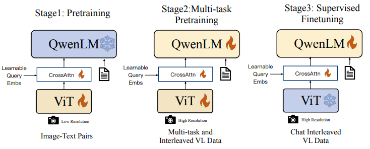
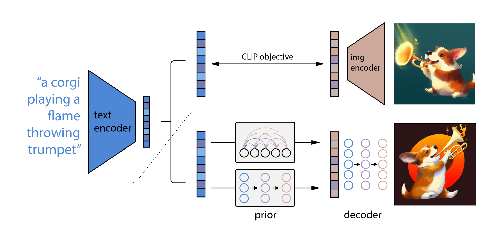
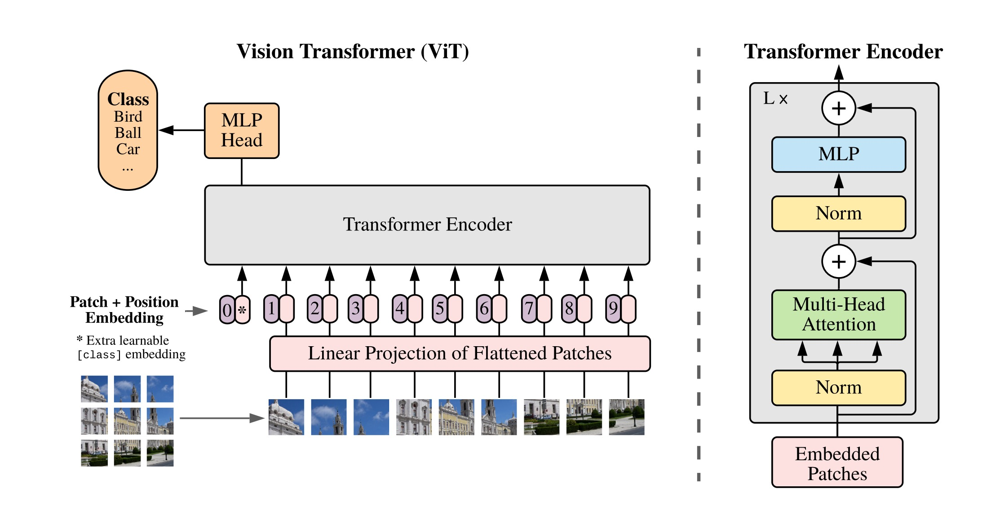

# BLIP

**BLIP**(Bootstrapping Language-Image Pretraining)是**salesforce**在2022年提出的多模态框架，是理解和生成的统一，引入了跨模态的编码器和解码器，实现了跨模态信息流动，在多项视觉和语言任务取得SOTA。

## 模型结构

**BLIP引入了编码器-解码器的多模态混合结构MED**（ Multimodal mixture of Encoder-Decoder）**，能够有效地进行多任务预学习和迁移学习。**MED包括两个单模态编码器（lmage Encoder，Text Encoder），一个以图像为基础的编码器（image-grounded text encoder）和一个以图像为基础的解码器（image-grounded text decoder）。

# CogVLM

# InstructBLIP

# LLaVA

# MiniGPT4

# QwenVL

2023-08

架构：

1、采用大型语言模型作为其基础组件。Qwen-7B(Qwen, 2023)的预训练权重进行初始化。

2、视觉编码器使用Vision Transformer(ViT)(Dosovitskiy et al., 2021)架构。使用Openclip的ViT-bigG(Ilharco et al., 2021)的预训练权重进行初始化。

3、位置感知的视觉语言适配器:为了缓解长图像特征序列带来的效率问题,Qwen-VL引入了一个压缩图像特征的视觉语言适配器。该适配器包含一个随机初始化的单层交叉注意力模块。该模块使用一组可训练向量(嵌入)作为查询向量,并使用来自视觉编码器的图像特征作为键进行交叉注意力操作。这种机制将视觉特征序列压缩为固定长度256。

训练方法：

1、第一阶段,我们主要利用大规模的弱标记网络爬取的图像-文本对

2、第二阶段的多任务预训练中,我们引入了高质量和细粒度的VL注释数据,以及较大的输入分辨率和交错的图像-文本数据。

3、通过指令微调对Qwen-VL预训练模型进行了微调,以增强其遵循指令和对话能力,得到交互式的Qwen-VL-Chat模型。指令调谐数据量为35万。

# ShareGPT4V

# LWM

大世界模型（ Large World Model ，LWM）

WORLD MODEL ON MILLION-LENGTH VIDEO AND LANGUAGE WITH RINGATTENTION

时间：2024-2-13

机构：UC伯克利

该研究在 Llama2 7B 的基础上训练了一个大型自回归 Transformer 模型，该模型具有长达 100 万个 token 的超大上下文窗口。为了实现这一点，研究团队采用多种策略：使用书籍资料将上下文扩展到 100 万个 token，然后在长多模态序列上进行联合训练，包括文本 - 图像、文本 - 视频数据和书籍资料。

本文的贡献可总结为如下几个方面：

（a）该研究在长视频和语言序列上训练了一个拥有极大上下文尺寸的 transformers 模型，从而设立了新的检索任务和长视频理解方面的标杆。

 (b) 为了克服视觉 - 语言训练带来的挑战，该研究采取了以下措施，包括使用掩码序列以混合不同长度的序列、损失加权以平衡语言和视觉、以及使用模型生成的问答数据来处理长序列对话。

 (c) 通过 RingAttention、掩码序列打包等方法，可以训练数百万长度的多模态序列。

 (d) 完全开源 7B 参数系列模型，其能够处理超过 100 万 token 的长文本文档（LWM-Text、LWM-Text-Chat）和视频（LWM、LWM-Chat）。

# Sora

## DALLE2

**CLIP训练过程：学习文字与图片的对应关系**
如上图所示，CLIP的输入是一对对配对好的的图片-文本对(根据对应文本一条狗，去匹配一条狗的图片)，这些文本和图片分别通过Text Encoder和Image Encoder输出对应的特征，然后在这些输出的文字特征和图片特征上进行对比学习
**DALL·E2：prior + decoder**
上面的CLIP训练好之后，就将其冻住了，不再参与任何训练和微调，DALL·E2训练时，输入也是文本-图像对，下面就是DALL·E2的两阶段训练：
阶段一 prior的训练：根据文本特征(即CLIP text encoder编码后得到的文本特征)，预测图像特征(CLIP image encoder编码后得到的图片特征)
推理时，文本还是通过CLIP text encoder得到文本特征，然后根据训练好的prior得到类似CLIP生成的图片特征，此时图片特征应该训练的非常好，不仅可以用来生成图像，而且和文本联系的非常紧(包含丰富的语义信息)

阶段二 decoder生成图：常规的扩散模型解码器，解码生成图像
这里的decoder就是升级版的GLIDE(GLIDE基于扩散模型)，所以说DALL·E2 = CLIP + GLIDE

## ViT

故为降低处理的复杂度，ViT把一张图像划分为九宫格(如下图的左下角)

## 如何将视觉数据转为patch?

LLM的成功是通过token实现的。此前已有研究表明，patch对视觉数据建模非常有效。

OpenAI研究者首先将视频压缩到一个低维潜空间中，随后把这种表征分解为时空patch，这样就实现了从视频到patch的转换。时空patch最大的好处, 是可以兼容所有的数据素材（像素、尺寸、时长）。

1、研究者开发了一个网络，来减少视觉数据的维度。Sora在这个压缩后的潜空间中进行训练，之后用于生成视频。Sora 可能采用的就是 VAE 架构，而VAE一般就是ConvNet。

2、Sora在这个压缩后的潜空间中进行训练，之后用于生成视频。

3、研究者还设计了一个对应的解码器模型，用于将生成的潜数据转换回像素空间。

## DiT-扩散Transformer

1、DiT 是一个带有 Transformer 主干的扩散模型，它 = [VAE 编码器 + ViT + DDPM + VAE 解码器]

因此，视频模型Sora是一个扩散模型；它能够接受带有噪声的patch（和条件信息，如文本提示）作为输入，随后被训练，来预测原始的「干净」patch。

重要的是，Sora是基于Transformer的扩散模型。在以往，Transformer在语言模型、计算机视觉和图像生成等多个领域，都表现出卓越的扩展能力。

# I-JEPA

# V-JEPA

# AnyGPT

复旦大学 2024-02 AnyGPT: Unified Multimodal LLM with Discrete Sequence Modeling

数据：我们利用现有的生成模型合成了各种模态交错的指令数据集AnyInstruct，包含108k条多轮对话样本，503k条语音，205k张图片和113k条音乐。此外，我们从现有的指令数据集中筛选并清洗了100k条适合朗读的数据，并合成了一个语音对话数据集，以增强模型的语音对话能力。

* 图像分词器  我们使用SEED分词器进行图像分词。SEED分词器包括几个 组件，包括ViT编码器， 因果Q-Former，VQ码书，多层感知器（MLP），以及一个UNet解 码器。SEED将224 × 224的RGB图像作为输入，ViT编码器将图像 编码为16 ×16个补丁，然后因果Q-Former将补丁特征转换为32个因果嵌入。一个有8192个 条目的码书将嵌入离散化为一系列量化代码。MLP用于将视觉代码解码为生成嵌入，该嵌入 与预训练的unCLIP Stable Diffusion的潜在空间对齐。最后，UNet解码器用于将生成嵌入恢复为原 始图像。
* 语音分词器  我们使用的语音分词器 是SpeechTokenizer， 采用带有剩余矢量量化（RVQ）的编码器-解 码器架构。SpeechTokenizer将单声道音频序 列压缩为离散化矩阵，使用八个具有1024个 条目的分层量化器，并实现50 Hz的帧速率。第一个量化器层捕获语义内容，而第2到8层 编码语调细节。因此，10秒音频被转换为 一个500 × 8矩阵，分为语义和声韵标记。我们采用一个在Commonvoice和Librispeech数据 集上预训练的SpeechTokenizer变体。
* 音乐分词器   尽管语音和音乐共享相似的数据 格式，但它们在实质内容上的差异使我们将 它们视为具有各自分词器的不同模态。对于音 乐，我们使用Encodec(D’efossez et al., 2022)作 为音乐分词器，这是一个带有使用剩余矢量 量化（RVQ）进行量化的卷积自动编码器，并 在20,000首音乐曲目上预训练。我们使用一个 现成的Encodec变体1，处理32kHz的单声道音 频，并实现50Hz的帧速率。生成的嵌入使用 具有2048个条目的四个量化器进行量化，从而 形成一个综合音乐词汇量大小为8192的矩阵。 

