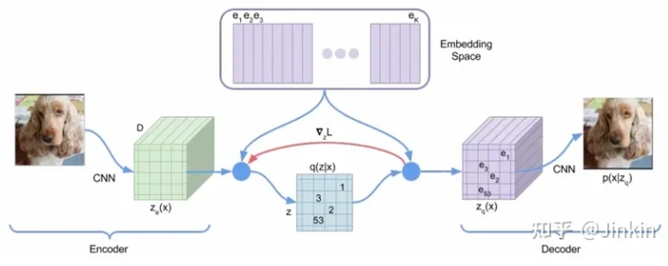
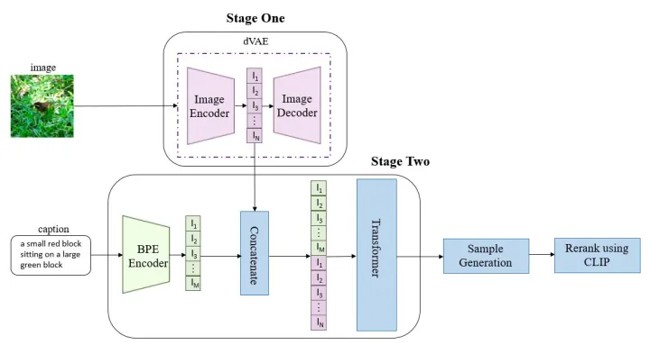

时间：2021.01.05

机构：OpenAI

# VQVAE

VQVAE的思路旨在学习一个codebook。什么是codebook？在NLP里，codebook就可以理解为一个小词典，里面装了最常用的单词，我们每一个长句子都能用这些词表示，这样就能达到一个压缩的效果。比如下面举了一个小例子，如果我们要编码左边这三个句子，我们需要六个词，码本大小为6，但是如果我们找到这些词的近义词：“我”，“很”，“开心”，那么我们的码本大小就为3了！这就是一个简单的量化压缩词典的过程。

在视觉里同理，我们可以找到数据集里那些**最常用的pixel**（通常有RGB三维），并把这些pixel放到词典里，我们就可以得到一个简单的visual codebook，minGPT[[2\]](https://zhuanlan.zhihu.com/p/506778898#ref_2)就是通过聚类的方式，聚类出数据集里最常用的512个RGB三维向量，作为码本。通用，这里量化的过程就是一个近似的过程，就如同上面的找近义词一样，这里会从codebook里找到最相似的pixel。

当然，这里的VQVAE并不是在pixel这个level上去学codebook的，那样似乎有些太简单粗暴，而是首先通过一个encoder，将图片映射到一个latent space，再在feature这个level上去学习出codebook。decoder呢，就是做一个反向映射，从latent space再映射回原图。

# Taming Tranformer

Codebook还有一个好处，就是说可以把图片表示为一串id序列（id就是codebook里每个visual code的id，如1、23、35、47、59这样的实数），这样就能很好地建模图像生成任务了！因为某个数据集的图片的id序列通常是满足某一种分布的，（比如1后面最可能是3，3后面最可能是14、29），这样图片生成任务就被建模成了一个NLP里经典的next-index prediction任务，对于这种问题，我们通常可以用transformer-decoder这种自回归模型去学习。

结合上面所说的，图像生成任务就被分成了两阶段，在stage1，会学习一个VQVAE，用以将图像压缩为离散编码（1、23、35...这种id序列），在stage2，再用一个自回归模型去找到这种id序列的规律，也就是分布，就可以啦。这也是DALL-E的一篇同期工作Taming Transfomer所用到的方法，至于细节上怎么做的，可以参考原文。

# DALL-E1

DALL-E1，只是把前面提到的two-stage方法给做到text2img上去了，而text2img像较于传统的图像生成，只是将image generation里的condition换为了text，TamingTransformer也能做text2img，有个很火的VQGAN+CLIP方法就是把Taming Tranformer的condition换成了CLIP text encoder对文本的输出。

DALL·E的目标是把文本token和图像token当成一个数据序列，通过Transformer进行自回归。由于图片的分辨率很大，如果把单个pixel当成一个token处理，会导致计算量过于庞大，于是DALL·E引入了一个dVAE模型来降低图片的分辨率。

DALL·E的整体流程如下：

第一个阶段，先训练一个dVAE把每张256x256的RGB图片压缩成32x32的图片token，每个位置有8192种可能的取值(也就是说dVAE的encoder输出是维度为32x32x8192的logits，然后通过logits索引codebook的特征进行组合，codebook的embedding是可学习的)。

第二阶段，用BPE Encoder对文本进行编码，得到最多256个文本token，token数不满256的话padding到256，然后将256个文本token与1024个图像token进行拼接，得到长度为1280的数据，最后将拼接的数据输入Transformer中进行自回归训练。

训练阶段，先训练dVAE模型，然后固定dVAE模型再来训练自回归的 Transformer

推理阶段，给定一张候选图片和一条文本，通过transformer可以得到融合后的token，然后用dVAE的decoder生成图片，最后通过预训练好的CLIP计算出文本和生成图片的匹配分数，采样越多数量的图片，就可以通过CLIP得到不同采样图片的分数排序

从以上流程可知，**dVAE**、**Transformer**和**CLIP**三个模型都是不同阶段独立训练的。下面讲一下dVAE、Transformer和CLIP三个部分。

