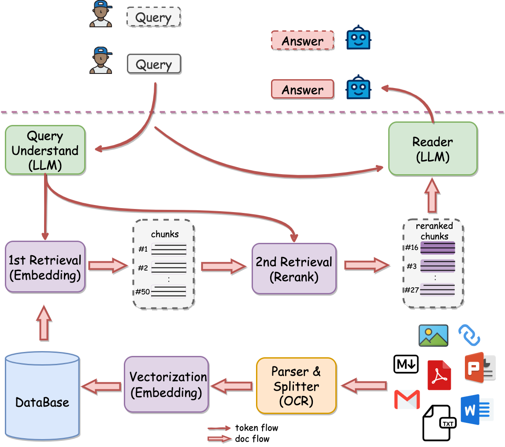

> 参考网易开源的RAG项目


## 项目流程图





## 为什么两阶段检索

知识库数据量大的场景下两阶段优势非常明显，如果只用一阶段embedding检索，随着数据量增大会出现检索退化的问题，如下图中绿线所示，二阶段rerank重排后能实现准确率稳定增长，即**数据越多，效果越好**。


## 什么是Query Understand

query understand主要是用于解决**多轮对话**和**意图识别**的一个环节。

多轮对话举例

```
query1: 清华大学怎么样？answer1:清华大学xxx
query2: 和北京大学比呢？
发现问题：此时用query2去检索，得到的全是北大的信息，回答有问题。
解决方法：
把历史对话和当前问题改写成一个独立问题，比如这里会改写成condense query: 清华大学和北京大学相比怎么样？
因为LLM有幻觉，这个condense query会被改错，所以最终回答还是用history + query2 + retrieval_docs
```

意图分类

```
有些问题不适合RAG回答，LLM自己就可以回答，或者有些问题需要查询MySQL库，这里用于分流问题。
```


