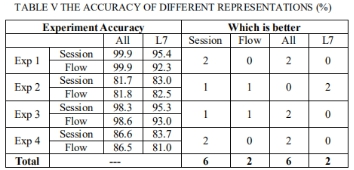
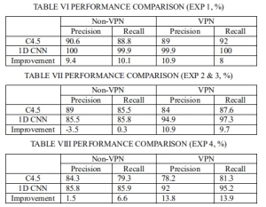
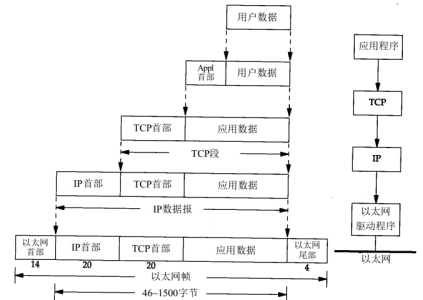
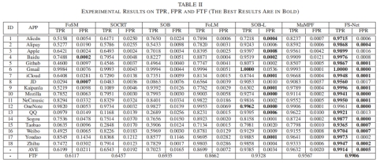

# 加密流量识别方法

## 按方法分类

**基于端口（port）的流量分类：**

优点：简单。

缺点：该方法的准确性一直在下降，因为较新的应用程序要么使用众所周知的端口号来掩盖其流量，要么不使用标准的注册端口号。

 

**基于有效载荷或数据包检验（data packet inspection：DPI）：**用于检查数据包的实际内容，而不仅仅是报头信息。基于已知的攻击特征或恶意文件的特征进行匹配。如正则表达式匹配、特征匹配、深度包检查等。

优点：简单快速，只需要检测网络流的前几个数据包。

缺点：方法仅适用于未加密的流量，且计算开销较大。

 

**基于流量统计特征：**这种方法通常关注网络流量的统计信息，如流量的大小、方向、持续时间、包的数量、传输速率等。

优点：可以用于加密流量，不需解密；轻量级、实时性。

缺点：依赖于人类的特征提取工程，有限精度、易受欺骗。

 

**基于深度学习方法：**

优点：深度学习可以通过训练自动选择特征，消除领域专家选择特征的需要，并且具有相当高的学习能力，因此可以学习高度复杂的模式，能够学习原始输入和相应输出之间的非线性关系，而不需要将问题分解为特征选择和分类的小子问题。

缺点：黑盒子，可解释性弱。

 

## 按数据分类

流量的形式在网络传输中是二进制的比特流形式，主要构造单元有数据包和会话流。其中数据包为传输最小完整单元（Packet-Based）；会话流由通信的设备两端的一个完整交互单元，由多个数据包组成（Flow-Based）。有的论文会分为：Packet-Based、Flow-Based、Session-Based。Flow-Based只包含单向数据流，Session-Based是双向数据流。

**基于数据包的方法：**

直接将数据包的字节作为输入，包括报头信息与有效载荷。基于包的方法只关注少数包的详细信息，缺乏对全局特征的关注。如：Deep Packet

 

**基于会话流的方法：**

基于特征分类，机器学习、深度学习都适合。

对流中的包长进行特征提取用于分类（FS-Net）。

对流中连续的几个报文进行分类（1D-CNN）。

同时使用CNN与RNN分别提取流量的空间特征与时间特征（耗时）。

ET-BERT: 预训练是flow-based，微调flow-based, packet-based都可以！

 

# 1D-CNN

论文：End-to-end Encrypted Traffic Classification with  One-dimensional Convolution Neural Networks 

时间：2017

网络流量划分粒度：

packet级：单个数据流

Flow级：一个会话中的单向数据流的集合，即同一方向的packet。

Session级：会话中所有数据流，双向的。

 

数据流从哪层取得：

ALL表示使用了所有层的包层选择

L7表示仅仅使用了OSI模型的第七层（应用层）的包层选择

ISCX-VPN-NonVPN-2016中的数据：

12分类：应用级分类，即所有数据。

2分类，协议封装的流量标识，即VPN vs nonVPN。

6分类：常规加密流量分类 / 协议封装的流量分类，分别有6个APP。

 

训练数据：数据是清理后的，取流或者会话的前n个字节作为模型输入，n取784（28*28）

 

实验和实验结果：

 

 

对比方法：C4.5

 

 

 

# Deep-Packet 

论文：Deep Packet: A Novel Approach For Encrypted Traffic Classification Using Deep Learning

[Deep Packet: A Novel Approach For Encrypted Traffic Classification Using Deep Learning | Papers With Code](https://paperswithcode.com/paper/deep-packet-a-novel-approach-for-encrypted)

时间：2018

数据集：ISCX VPN-nonVPN：该数据集实在数据链路层捕获的，因此，每个数据包都包含一个以太网报头、一个IP数据报报头、一个TCP/UDP报头。

 

预处理：

1.删除以太网报头

2.将UDP报头填充0至20字节长度（TCP通常具有20字节长度的报头，而UDP具有8字节长度的报头。为了使传输层的段一致，在UDP段的报头末尾注入0，使它们的长度与TCP报头相等）

3.屏蔽IP数据报报头的IP

4.删除不相关的数据包，例如没有负载的数据包（TCP握手时SYN、ACK设置为1以及FIN设置为1的数据包）或者DNS数据段（将url转为IP地址的）

5.将原始数据包转为字节向量

6.截断超过1500的向量，不足1500长度的填充0

7.将向量的每个元素除以255来规范化字节向量

8.针对样本不均衡问题，对样本更多的类进行欠采样，直到类相对平衡。

# FS-Net

论文：FS-Net: A Flow Sequence Network For Encrypted Traffic Classification

时间：2019

分类特征：Flow级的特征（特征是每个数据流的长度）

数据集：自己收集的，不公开数据。

实验结果+对比方法：

# CNN+RNN+RF

论文：Deep Learning for Network Traffic Classification

[Deep Learning for Network Traffic Classification | Papers With Code](https://paperswithcode.com/paper/deep-learning-for-network-traffic)

时间：2021

方法：CNN+RNN+随机森林

深度学习CNN+RNN：用包

机器学习RF：用特征

# ET-BERT

论文：ET-BERT: A Contextualized Datagram Representation with Pre-training Transformers for Encrypted Traffic Classification

时间：2022-02

该方法主要分为三个部分：A. 预处理和编码加密流量为 token 组成的 BURST 结构，B. 预训练学习加密流量报文的关联关系，C. 将预训练模型应用到下游任务中微调。

BURST 结构：Flow-Based级别数据流，转成16进制后，4个一组作为token。

预训练：类似于BERT，通过掩码 BURST 预测任务（Masked BURST Model）和同源 BURST 预测任务（Same-origin BURST Prediction）学习。

微调：包括包级别和流级别。

# TFE-GNN 

论文：

时间：2023-07

背景：

1、ET-BERT只学习flow-level features，如果flows较短效果不好。

2、本文提出byte-level流量图方法。

# CLE-TFE

论文：One Train for Two Tasks: An Encrypted Traffic Classification Framework Using Supervised Contrastive Learning

时间：2024-02

方法：对比学习+图神经网络

背景：

1、ET-BERT直接学习统计特征或原始字节的表示，没有考虑不同样本特征之间的潜在共性，因此不能充分揭示数据中包含的语义不变信息。

2、对比学习更能学习到高层语义。

# 参考

加密流量分类专题博客：

https://blog.csdn.net/qq_45125356/category_11988781.html

 

代码：

1D-CNN: https://blog.csdn.net/qq_45125356/article/details/126956497

FS-Net(没有数据集): https://github.com/WSPTTH/FS-Net

Deep-Packet: [https://blog.munhou.com/2020/04/05/Pytorch-Implementation-of-Deep-Packet-A-Novel-Approach-For-Encrypted-Tra%EF%AC%83c-Classi%EF%AC%81cation-Using-Deep-Learning/](https://blog.munhou.com/2020/04/05/Pytorch-Implementation-of-Deep-Packet-A-Novel-Approach-For-Encrypted-Traffic-Classification-Using-Deep-Learning/)

ET-BERT（代码有问题）: https://github.com/linwhitehat/ET-BERT

ET-BERT复现（代码可用）：https://gitee.com/xxdxxdxxd/et-bert/tree/master

