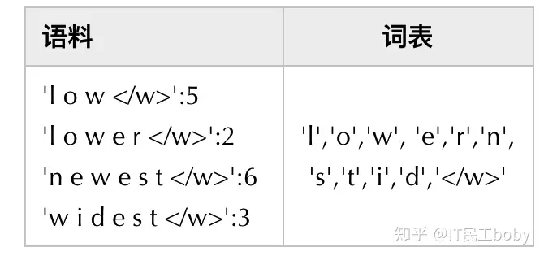
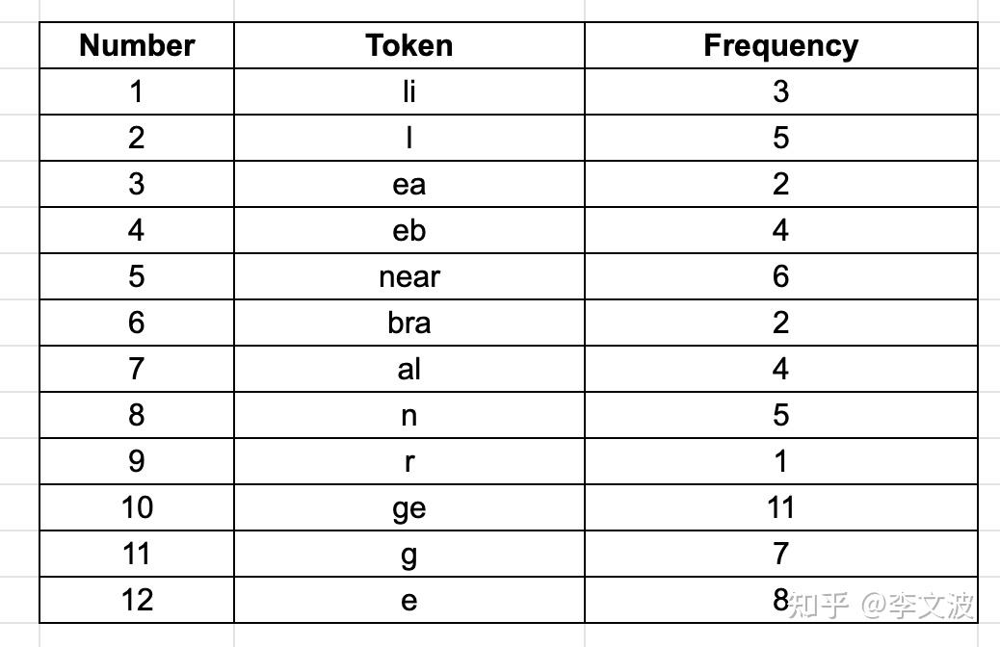

# 引言

**为什么分词？**

句子不能直接处理，句子要离散化处理。

**基于统计的分词**

先对各个句子进行分词，然后再统计并选出频数最高的前N个词组成词表。

缺点：

1、词的数量很多，词表不全，容易出现(Out Of Vocabulary, OOV)，模型无法处理；

2、低频词模型无法得到充分训练。

**字符粒度的分词**

如，英文单词最终是26个英文字母，虽然能够解决OOV问题，但单词被拆分成字符后，一方面丢失了词的语义信息，另一方面，模型输入会变得很长，这使得模型的训练更加复杂难以收敛。

**Subword(子词)分词**

它的划分粒度介于词与字符之间，比如可以将”looking”划分为”look”和”ing”两个子词，而划分出来的"look"，”ing”又能够用来构造其它词。

目前有三种主流的Subword算法，它们分别是：Byte Pair Encoding (BPE), WordPiece和Unigram Language Model。

# N-gram模型

**什么是N-gram模型？**

如果我们有一个由 m 个字/词组成的序列（或者说一个句子），我们希望算得句子的概率，根据链式规则，可得


这个概率显然并不好算，不妨利用马尔科夫链的假设，即当前这个词仅仅跟前面几个有限的词相关。

当 n=1, 一个一元模型（unigram model)即为 ：


当 n=2, 一个二元模型（bigram model)即为 ：


通过我们的标准语料库，我们可以近似的计算出所有的分词之间的二元条件概率，比如任意两个词，它们的条件概率分布可以近似的表示为


利用语料库建立的统计概率，对于一个新的句子，我们就可以通过计算各种分词方法对应的联合分布概率，找到最大概率对应的分词方法，即为最优分词。

N元模型的分词方法虽然很好，但是要在实际中应用也有很多问题：

* 某些生僻词，概率为0。（这种情况我们一般会使用拉普拉斯平滑，即给它一个较小的概率值）
* 句子长，分词有很多情况，计算量也非常大，这时我们可以用下一节维特比算法来优化算法时间复杂度。


**上面只是根据分词计算出句子概率，那么如何分词？维特比算法。**

为了简化原理描述，我们本节的讨论都是以二元模型为基础。

维特比算法采用的是动态规划来解决这个最优分词问题的，动态规划要求局部路径也是最优路径的一部分，很显然我们的问题是成立的。首先我们看一个简单的分词例子："人生如梦境"。它的可能分词可以用下面的概率图表示：

对于每个词，我们都可以计算出它的频率和二元条件概率。


从后往前推，最终的分词结果为"人生/如/梦境"。

# BPE

BPE最早是一种数据压缩算法，由Sennrich等人于2015年在《Neural Machine Translation of Rare Words with Subword Units》中提出引入到NLP领域并很快得到推广。该算法简单有效，因而目前它是最流行的方法。

## 词表构建

BPE分词/词表构建步骤：

1. 准备足够大的训练语料，并确定期望的Subword词表大小；
2. 将单词拆分为成最小单元。比如英文中26个字母加上各种符号，这些作为初始词表；
3. 在语料上统计单词内相邻单元对的频数，选取频数最高的单元对合并成新的Subword单元；
4. 重复第3步直到达到第1步设定的Subword词表大小或下一个最高频数为1.

示例：

准备预料，初始词表。注意这里一定加终止符`</w>`，中止符可以区分单词边界。



不断合并高频词，一直重复这个过程，直至达到词表大小。


## 语料编码

BPE分词后，编码步骤：

1. 词表从大到小排序；
2. 遍历排序好的词表，寻找词表中的子词是否是该单词的子字符串。如果正好**「匹配」**，则输出当前子词，并对单词剩下的字符串继续匹配；
3. 如果遍历完词表，单词中仍然有子字符串没有被匹配，那我们将其替换为一个特殊的子词，比如`unk`。

示例：

 假设有词表

```
(“errrr</w>”, 
“tain</w>”, 
“moun”, 
“est</w>”, 
“high”, 
“the</w>”, 
“a</w>”,
“ve</w>”)
```

对于给定的单词`mountain`，其分词结果为：[`moun`, `tain</w>`]。

对于给定的单词`love`, 其分词结果为：[`unk`, `unk`, `ve</w>`]

## 语料解码

语料解码就是将所有的输出子词拼在一起，直到碰到结尾为`<\w>`。

假设模型输出为

```
["moun", "tain</w>", "high", "the</w>"]
```

解码的结果

```
["mountain</w>", "highthe</w>"]
```

## 代码实现BPE

```
import re


# 语料库
def get_vocab(in_data_list):
    vocab = {}
    for line in in_data_list:
        words = line.strip().split()
        for word in words:
            vocab[' '.join(list(word)) + ' </w>'] = vocab.get(' '.join(list(word)) + ' </w>', 0) + 1
    return vocab


# 统计当前语料库所有tokens以及其对应的数量
def get_tokens(vocab):
    tokens = {}
    for word, freq in vocab.items():
        cur_chars = word.split()
        for cur_char in cur_chars:
            tokens[cur_char] = tokens.get(cur_char, 0) + freq

    return tokens


# 获取所有可能组成pair的token合体之后的频率
def get_stats(vocab):
    pairs = {}
    for word, freq in vocab.items():
        cur_tokens = word.split()
        for i in range(len(cur_tokens) - 1):
            pairs[(cur_tokens[i], cur_tokens[i + 1])] = pairs.get((cur_tokens[i], cur_tokens[i + 1]), 0) + freq
    return pairs


# 给定特定的pair 比如(e, s) 将vocab中所有(e,s)合并
def merge_vocab(pair, in_vocab):
    out_vocab = {}
    bigram = re.escape(' '.join(pair))
    p = re.compile(r'(?<!\S)' + bigram + r'(?!\S)')
    for word in in_vocab:
        w_out = p.sub(''.join(pair), word)
        out_vocab[w_out] = in_vocab[word]
    return out_vocab


data_list = ['i love dogs', 'i loved you']
cur_vocab = get_vocab(data_list)
print(f'Begining vocab: {cur_vocab}')
cur_tokens = get_tokens(cur_vocab)
print(f'Begining tokens: {cur_tokens}')

# 合并到词表达到指定大小 size大于等于原vocab的大小
to_merged_vocab_size = 7
epoch = 0
while len(cur_tokens) > to_merged_vocab_size:
    print('-' * 50)
    pairs = get_stats(cur_vocab)
    if not pairs:
        break
    max_freq_pair = max(pairs, key=pairs.get)
    cur_vocab = merge_vocab(max_freq_pair, cur_vocab)
    print(f'Iter: {epoch}')
    print(f'max_freq_pair: {max_freq_pair}')
    print(f'cur vocab: {cur_vocab}')
    cur_tokens = get_tokens(cur_vocab)
    print('Tokens: {}'.format(cur_tokens))
    print(f'len tokens:{len(cur_tokens)} ')
    epoch += 1

```

# Byte-level BPE

BPE的算法最开始的基础词表也可能会很大，比如如果将所有的unicode 字符都放入基础词表，一开始的词表大小就有十几万了。一种处理方法是我们**以一个字节为一种“字符”**，基础字符集的大小就锁定在了**2^8=256**。

例如，GPT-2的词汇表大小为50257 = 256 + `<EOS>` + 50000 mergers，`<EOS>`是句子结尾的特殊标记。

# WordPiece

最早出现在2016年谷歌的论文Google’s Neural Machine Translation system。 2018 年 BERT 中也用了。

它可以被认为是 BPE 和 Unigram 算法的折中。WordPiece 也是一种贪婪算法，它利用似然性而不是计数频率来合并每次迭代中的最佳对，但配对字符的选择是基于计数频率的。因此，在选择要配对的字符方面，它与 BPE 类似；在选择要合并的最佳对方面，它与 Unigram 类似。

## 原理

BPE算法通过循环的方式不断将一些高频的pair进行合并，通过贪婪的方式，每一步都将将高频的组合进行合并。这种方法存在的一个主要问题是：一个词可能存在多种拆分方式，对于算法来说，难以评估使用那个拆分方式比较合理，可以组合的列表中的优先级无法确定，通常会直接取第一个，举个例子：



例如：linear = **li + near** 或者 **li + n + ea + r**，这两种拆分方法哪个好坏，无法评价。所以，比BPE使用频次进行merge更好的方法是， 在merge的时候考虑merge前后的影响到底有多大。

WordPiece选择能够提升语言模型似然概率最大的相邻子词加入词表。例如，在考虑将"e"和"s"合并的时候除了会考虑"es"的概率值，还会考虑"e"和"s"的概率值。

**似然概率怎么计算？**

假设句子$S=(t1, t2,,,tn)$，则句子S的语言模型似然值是：


假设把相邻位置的x和y两个子词进行合并，合并后产生的子词记为z，此时句子S似然值的变化可表示为：


遍历所有的字符对，合并Loss最大的字符对。

**不太好理解？**

拆分前信息熵为-log(p(tz))，拆分后为-log(p(tx)) - log(p(ty)) ，拆分后-拆分前的信息增益为-log(p(tx)) - log(p(ty)) + log(p(tz))，可以变形为上式。信息增益越大越好。


## 词表构建

**WordPiece算法的主要步骤如下：**

1. 准备足够大的训练语料
2. 确定期望的subword词表大小
3. 将单词拆分成字符序列
4. 基于第3步数据训练语言模型
5. 从所有可能的subword单元中选择加入语言模型后能最大程度地增加训练数据概率的单元作为新的单元
6. 重复第5步直到达到第2步设定的subword词表大小或概率增量低于某一阈值

构建分词表后，编码解码步骤和BPE一样。


WordPiece有两种代码实现方式：bottom-up 和 top-down。最初的WordPiece和BPE一样基于bottom-up的，而BERT是基于 top-down。对于日语、中文和韩语，这种 top-down 的方法不起作用，因为没有明确的token units 可以开始。

## 代码实现

**这里是WordPiece的bottom-up算法实现**

top-down算法请参考https://www.tensorflow.org/text/guide/subwords_tokenizer#optional_the_algorithm


WordPiece算法分词时，会在非单词开头的字符上加上`##`前缀。如love，分词是

```
l
##o
##v
##e
```

代码示例

```
from collections import defaultdict


def get_word_freqs(pre_tokenized_res):
    word_freqs = {}
    for word in pre_tokenized_res:
        word_freqs[word] = word_freqs.get(word, 0) + 1
    return word_freqs


def get_word_splits(word_freqs):
    word_splits = {}
    for word in word_freqs.keys():
        word_splits[word] = [c if i == 0 else f"##{c}" for i, c in enumerate(word)]
    return word_splits


def get_base_vocab(word_freqs, word_splits):
    vocab = {}
    for word, freq in word_freqs.items():
        for subword in word_splits.get(word):
            vocab[subword] = vocab.get(subword, 0) + freq
    return vocab


def get_pair_scores(word_freqs, word_splits, vocab):
    pair_freqs = {}
    for freq, split in zip(word_freqs.values(), word_splits.values()):
        for i in range(len(split) - 1):
            pair = (split[i], split[i + 1])
            pair_freqs[pair] = pair_freqs.get(pair, 0) + freq
    pair_scores = {}
    for pair, freq in pair_freqs.items():
        pair_scores[pair] = freq / (vocab[pair[0]] * vocab[pair[1]])
    return pair_scores


def merge_pair(pair, word_splits):
    a, b = pair
    for word, split in word_splits.items():
        if len(split) == 1:
            continue
        i = 0
        while i < len(split) - 1:
            if split[i] == a and split[i + 1] == b:
                new_word = a + b[2:] if b.startswith('##') else a + b
                split = split[:i] + [new_word] + split[i + 2:]
            i += 1
        word_splits[word] = split
    return word_splits


def wordpiece_train(vocab_size, word_freqs, word_splits):
    vocab = get_base_vocab(word_splits)
    while len(vocab) < vocab_size:
        pair_scores = get_pair_scores(word_freqs, word_splits)
        if not pair_scores:
            break
        max_score_pair = max(pair_scores, key=pair_scores.get)
        word_splits = merge_pair(max_score_pair, word_splits)
        a, b = max_score_pair
        new_word = a + b[2:] if b.startswith('##') else a + b
        vocab.append(new_word)
    return vocab


"""
I love dogs
I loved you
"""
corpus = ['I', 'love', 'dogs', 'I', 'loved', 'you']
word_freqs = get_word_freqs(corpus)
print(f"word_freqs: {word_freqs}")
word_splits = get_word_splits(word_freqs)
print(f"word_splits: {word_splits}")
vocab = get_base_vocab(word_freqs, word_splits)
print(f"vocab: {vocab}")

# 合并到词表达到指定大小
to_merged_vocab_size = 7
epoch = 0
while len(vocab) > to_merged_vocab_size:
    print('-' * 50)
    print(f'epoch: {epoch}')
    pair_scores = get_pair_scores(word_freqs, word_splits, vocab)
    if not pair_scores:
        break
    max_score_pair = max(pair_scores, key=pair_scores.get)
    print(f'max_score_pair: {max_score_pair}')
    word_splits = merge_pair(max_score_pair, word_splits)
    print(f'word_splits: {word_splits}')
    vocab = get_base_vocab(word_freqs, word_splits)
    print(f'vocab: {vocab}')
print('-' * 50)
print(f'vocab: {list(vocab.keys())}')
```


# Unigram

## 原理

Unigram 语言建模2018在 《 Improving neural network translation models with multiple subword candidates》 中提出。与WordPiece一样，Unigram Language Model(ULM)同样使用语言模型来挑选子词。不同之处在于，BPE和WordPiece算法的词表大小都是从小到大变化，属于增量法。而Unigram Language Model则是减量法,即先初始化一个大词表，根据评估准则不断丢弃词表，直到满足限定条件。UniLM算法考虑了句子的不同分词的可能行，因而能够获得不同分词结果所对应的概率。

我们接下来看看UniLM是如何操作的。

因为Unigram是先有一个大词表，不断丢弃分词，直到满足条件。这个大词表，比如先用BPE算法求得。

已知词表是V，xi是句子的分词结果，p(xi)该分词出现的频率，当前分词下句子X的似然值可以表示为P(X)：


> 似然常常被用作概率的同义词。但是在[统计学](https://so.csdn.net/so/search?q=统计学&spm=1001.2101.3001.7020)中，二者有截然不同的用法，那在统计学中：
>
> ​    1.概率描述的是：指定参数后，预测即将发生事件的可能性。
>
> ​    2.似然描述的是：在一直某些观测所得到的结果时，对有关实物的性质的参数进行估计。


假设|D|是语料库中语料数量，s表示句子索引，X是句子， S(x)是句子x的所有候选分割，将语料库中所有句子的所有分词组合形成的概率相加为（似然）：


>有样本，及样本服从的分布模型。求模型参数，是极大似然估计。
>
>有样本，及多个分布模型；求样本属于哪个分布、求模型参数，是EM估计。

求解**分布的参数**和**分布(概率)**，即求解最优的**词表**和**分词的概率**，用EM算法。EM算法就是初始化参数+迭代，随意最后的分词过程是：

```
1.初始时，建立一个足够大的词表(种子词表)。一般，可用语料中的所有字符加上常见的子字符串初始化词表，也可以通过BPE算法初始化。
2.重复这一步直到词表的大小符合预期
a.针对当前这一轮的词表，估计每个子词在语料上的概率P(xi)。
b.对于每个子词，计算当该子词被从词表中移除时，总的loss降低了多少，记为该子词的loss(xi)。
c.将子词按照loss大小进行排序，丢弃一定比例loss最小的子词(比如20%)，保留下来的子词生成新的词表。这里需要注意的是，单字符不能被丢弃，这是为了避免OOV情况。
```

可以看出，ULM会保留那些以较高频率出现在很多句子的分词结果中的子词，因为这些子词如果被丢弃，其损失会很大。

按照EM算法描述是：

```
1.初始化模型参数（词表）
2.迭代
a.计算联合分布的条件概率期望（计算概率）
b.c.极大化求解，得到新的参数（词表）
```


## 代码实现

**如何计算语料库Loss？**

语料库的Loss，就是所有句子Loss，就是所有字的Loss乘以频率

$$Loss(corpus)=\sum{Loss(X_i)} = \sum freqs_j Loss(word_j)$$

**如何计算字的最大Loss？**

就是字的分词的概率

$$Loss(word_i) = P(tokenize(word_i))$$

**如何分词？如何计算分词的概率？**

已知分词表，及分词的概率，可以使用维特比算法，求出字的分词。

**代码：**

```
from typing import Dict, List, Tuple
import copy
import math


def get_word_freqs(pre_tokenized_res):
    word_freqs = {}
    for word in pre_tokenized_res:
        word_freqs[word] = word_freqs.get(word, 0) + 1
    return word_freqs


def init_vocab(word_freqs, init_vocab_size):
    char_freqs = {}
    subword_freqs = {}
    for word, freq in word_freqs.items():
        for i in range(len(word)):
            char_freqs[word[i]] = char_freqs.get(word[i], 0) + freq
            # 子词的长度至少是2，并且word[i:j]是左闭右开，因此j最多要取到len(word)
            for j in range(i + 2, len(word) + 1):
                # 必须是严格子词，即不能包含自身
                if j - i < len(word):
                    subword_freqs[word[i:j]] = subword_freqs.get(word[i:j], 0) + freq
    char_freqs = sorted(char_freqs.items())
    subword_freqs = sorted(subword_freqs.items(), key=lambda x: x[1], reverse=True)
    assert init_vocab_size > len(char_freqs)
    vocab_with_freqs = char_freqs + subword_freqs[:init_vocab_size - len(char_freqs)]
    return dict(vocab_with_freqs)


# 计算分词loss
def process_vocab(vocab_with_freqs: Dict[str, int]) -> Dict[str, float]:
    total_sum = sum(vocab_with_freqs.values())
    vocab_with_loss = {token: -math.log(freq / total_sum) for token, freq in vocab_with_freqs.items()}
    return vocab_with_loss


# 已知分词表+分词频率，可以用维特比算法分词
def tokenize_word(word: str, vocab_with_loss: Dict[str, float]):
    dp = [{'start': None, 'loss': None} for _ in range(len(word) + 1)]
    dp[0] = {'start': -1, 'loss': 0}

    for i in range(len(word)):
        for j in range(i + 1, len(word) + 1):
            token = word[i:j]
            if token in vocab_with_loss and dp[i]['loss'] is not None:
                new_loss = dp[i]['loss'] + vocab_with_loss[token]
                if dp[j]['loss'] is None or new_loss < dp[j]['loss']:
                    dp[j] = {'start': i, 'loss': new_loss}

    word_loss = dp[-1]['loss']
    if word_loss is None:
        return ['[UNK]'], word_loss

    start, end = dp[-1]['start'], len(word)
    res = []
    while ~start:
        res.append(word[start:end])
        end = start
        start = dp[start]['start']

    res.reverse()
    return res, word_loss


# 计算语料库Loss = sum(freq(x) * tokenize_word(x))
def corpus_loss(word_freqs, vocab_with_loss):
    loss = 0
    for word, freq in word_freqs.items():
        loss += freq * tokenize_word(word, vocab_with_loss)[1]
    return loss


# 计算每个分词的score = Loss_i - Loss
def compute_scores(word_freqs, vocab_with_loss) -> List[str]:
    scores = {}
    pre_loss = corpus_loss(word_freqs, vocab_with_loss)
    for token in vocab_with_loss:
        if len(token) == 1: continue
        vocab_with_loss_ = copy.deepcopy(vocab_with_loss)
        vocab_with_loss_.pop(token)
        cur_loss = corpus_loss(word_freqs, vocab_with_loss_)
        scores[token] = cur_loss - pre_loss
    return sorted(scores, key=lambda x: x[1])


"""
I love you very much
I am very hungry
"""
corpus = ['I', 'love', 'you', 'very', 'much', 'I', 'am', 'very', 'hungry']
word_freqs = get_word_freqs(corpus)
print(f'word_freqs: {word_freqs}')

# 初始化词表大小
init_vocab_size = 50
vocab_with_freqs = init_vocab(word_freqs, init_vocab_size)
print(f'vocab_with_freqs: {vocab_with_freqs}')
vocab_with_loss = process_vocab(vocab_with_freqs)
print(f'vocab_with_loss: {vocab_with_loss}')

vocab_size = 15 # 最终词表大小
p = 0.1         # 舍弃比率
epoch = 0
while len(vocab_with_loss) > vocab_size:
    print('-----------')
    print(f'epoch: {epoch}')
    epoch += 1
    scores = compute_scores(word_freqs, vocab_with_loss)
    print(f'scores: {scores}')
    num_to_remove = min(int(len(vocab_with_loss) * p), len(scores))
    if num_to_remove == 0:
        break
    for i in range(num_to_remove):
        vocab_with_freqs.pop(scores[i])
    vocab_with_loss = process_vocab(vocab_with_freqs)
    print(f'vocab_with_freqs: {vocab_with_freqs}')
    print(f'vocab_with_loss: {vocab_with_loss}')

print('-----------')
print(f'vocab_with_loss: {vocab_with_loss}')
print(len(vocab_with_loss))

```


