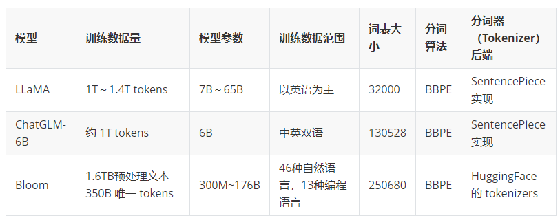

# 为什么要扩充词表

什么时候需要扩充词表？

* 要微调的模型不支持中文，如LLaMA
* 要微调一个领域模型，最好加入领域内词汇，如医疗上的`美托洛尔`。

扩充词表的原因：

- LLaMA 原生tokenizer词表中仅包含少量中文字符，在对中文字进行tokenzation时，一个中文汉字往往被切分成多个token（2-3个Token才能组合成一个汉字），显著降低编解码的效率。
- 预训练中没有出现过或者出现得很少的语言学习得不充分。

扩充词表后带来的优点：

**1.提高模型的编解码的效率**，在LLaMa原来的词表上，一个汉字平均1.45个token，扩充后的Chinese-LLaMa为0.65个token；那在垂直领域内呢？比如在LLaMa在继续扩充领域内词表，金融或者医疗等等，把“负债表”，“糖尿病”等领域词汇也加入词表里，那更加能提高其编解码的效率。

**2.提高模型的上下文窗口长度**，原LLaMa上下文长度是4096个token，不扩充词表前，按1.45来算就是最多只能输入2824个汉字，扩充后以0.65来算的话就是6301，垂直领域会更大。这点带来的好处是实打实的。

**3.提高模型的效果？**提高LLaMa在中文的表现？提高开源模型在垂直领域的表现？这一点上难以下结论，目前好像也没有确定的结论，自我感觉会有，但是不多，而且可能在垂直领域扩充词表后，垂直领域词太多过拟合影响通用领域效果，还有就是扩充完词表后还要经过一系列的后续处理和训练，可以控制变量的研究一下，但需要很多的资源哈哈。但是前两点的好处是实打实的，所以在有资源的情况下，扩充词表还是可以尝试的。

# SentencePiece

SentencePiece是谷歌推出的子词开源工具包，其中集成了BPE、ULM子词算法。除此之外，SentencePiece还能支持字符和词级别的分词。目前大模型的词表和分词器都是基于SentencePiece工具实现的，比如LLaMa，BLOOM，ChatGLM，Baichuan等。

SentencePiece主要解决了以下三点问题：

1. 以unicode方式编码字符，将所有的输入（英文、中文等不同语言）都转化为unicode字符，解决了多语言编码方式不同的问题。
2. 将空格编码为‘_’， 如'New York' 会转化为['▁', 'New', '▁York']，这也是为了能够处理多语言问题，比如英文解码时有空格，而中文没有， 这种语言区别
3. 优化了速度，如果您实时处理输入并对原始输入执行标记化，则速度会太慢。 SentencePiece 通过使用 BPE 算法的优先级队列来加速它来解决这个问题，以便您可以将它用作端到端解决方案的一部分。

在中文上，就是把经常在一起出现的字组合成一个词语；在英文上，它会把英语单词切分更小的语义单元，减少词表的数量。

分词后.model和.vocab文件，model文件包含算法类型、超参数、词汇表等，只需要加载.model文件就足够了。.vocab仅用于查看模型学到的词汇表。

